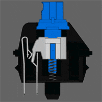
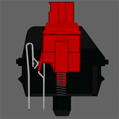
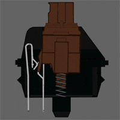

# 키보드의 종류와 특징

### 목록

- 멤브레인
- 기계식
    - 클릭
    - 리니어
    - 넌클릭(택타일)
- 무접점
- 번외

## 1. 멤브레인
멤브레인키보드는 우리가 쉽게 접할 수 있는 키보드입니다. 멤브레인키보드는 러버돔을 사용한 키보드로, 타자를 쳤을 때 눌린 키가 고무 탄성으로 제자리로 돌아오는 방식입니다. 소음이 적고 내구성이 좋으며 개별적인 스프링이 없기 때문에 기계식키보드보다 저렴합니다.

## 2. 기계식 키보드
멤브레인과는 달리 키 하나하나에 스위치가 달려 있는 구조로 스위치에 스프링으로 인해 키가 제자리로 돌아오며, 눌렀을 때 스위치내부의 금속접점으로 입력이 되는 방식입니다.(각 축의 이미지는 체리사의 축을 예로 듭니다.)

#### 클릭

클릭 스위치는 스템 부분에 걸쇠가 있고 일정 압력이 들어가면 흰색 스템 부분이 강하게 내려가기 때문에 찰칵찰칵하는 큰 소리가 나는 스위치 입니다.(이미지는 체리사의 청축입니다.)
#### 리니어

리니어 스위치는 스위치 스템 부분에 걸쇠가 없어 걸림 없이 부드럽게 눌리는 스위치 입니다. (이미지는 체리사의 적축입니다.)
#### 넌클릭(택타일)

넌클릭 스위치는 내부 구조는 리니어와 유사하지만 청축처럼 걸쇠가 있기때문에 걸리는 느낌은 있지만 청축과는 구조가 달라서 큰소리는 나지 않습니다.(이미지는 체리사의 갈축입니다.)

## 3.무접점

무점점 키보드는 멤브레인처럼 러버돔을 쓰는 키보드 이지만 내부구조와 작동 방식이 다르다 러버돔 및에 스프링이 압력을 받으면 기판에서 전압을 감지해 입력이 되는 방식입니다.

-[번외](secondfile.md)
